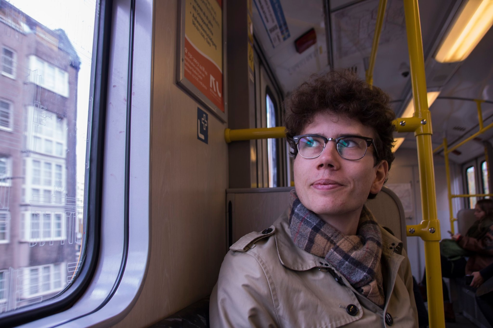

# Love Kildetoft
## Physicist, awesomemist, pianist?

Currently a master student in physics at Lund university, working with medical optics  and fluorescence imaging
at the division of combustion physics. 

I *really* like Monte-Carlo simulations (https://en.wikipedia.org/wiki/Monte_Carlo_method), so here are some cool ones I've made

### Random walkers on a 3-dimensional lattice 
that interact by destroying eachother when they meet. Somehow analogous to gas molecules in a box.

https://github.com/lkildetoft/Vicious-walkers

### The Monty-Hall problem 
(see https://en.wikipedia.org/wiki/Monty_Hall_problem)

https://github.com/lkildetoft/Monty-Hall-problem

### ICG-sim,
my magnum opus, currently being used for my masters project. Simulates the fluorescence from indocyanine-green obtained when illuminated with a near-infrared incoherent light source, specifically in a physiology which is obtained after a patient has undergone surgery for esophageal cancer (esophagectomy). 

https://github.com/lkildetoft/ICG-sim

### My bachelor thesis

https://lup.lub.lu.se/student-papers/search/publication/9049610
